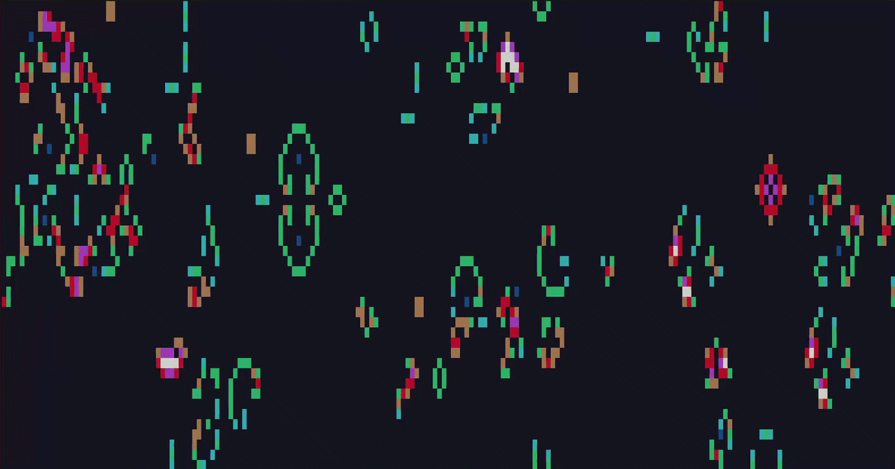

# Conway's Game of Life



This application is a demo of **[Conway's Game of Life](https://en.wikipedia.org/wiki/Conway%27s_Game_of_Life)**.

## Why?

I wrote this software to improve my personal knowledge of the *C language*, *libc*, the *`nurses` library*, and how *Unix-like terminals* work.

## Requirements

- Unix-like operating system
- GNU Make (`make`)
- GNU GCC compiler (`gcc`)
- `libncurses`

## Build

Use the following command inside the `conway-game-of-life/` directory:

```
make
```

The executable file `conwaygol` should be present inside the created directory `build/`.

## Usage

```
Usage: build/conwaygol [-v | --version] [-h | --help] [-t <uint> | --timeout <uint>] [--char | --bw | --color] <file-path>

Options:
  -h               = print this info
  --help
  -v               = print application's version
  --version
  -t <uint>        = define timeout time in ms (default is '100' ms)
  --timeout <uint>
  --char           = uses char '*' for alive cells
                     this is the default mode for terminals without colors
  --bw             = uses color white for alive cells
  --color          = uses colors for alive cells (depending on alive neighbors)
                     this is the default mode for terminals with colors

Usable commands:
  W | UP    = move up one cell
  S | DOWN  = move down one cell
  A | LEFT  = move left one cell
  D | RIGHT = move right one cell
  E         = turn on/off selected cell
  ENTER     = start game
  CTRL+Q    = quit
```

## Resources

The resources that I used to create this software are the following:

- [ncurses - Programming HOWTO](https://invisible-island.net/ncurses/howto/NCURSES-Programming-HOWTO.html)
- [math.com - Wonders of Math - What is the Game of Life?](https://www.math.com/students/wonders/life/life.html)
- [GitHub - cdkw2/conway-screensaver](https://github.com/cdkw2/conway-screensaver)
- [GitHub - cpressey/ncurses_programs](https://github.com/cpressey/ncurses_programs)
- [YouTube - Salvatore Sanfilippo - Impariamo il C: lezione 8 (implementiamo il Conway's Game of Life)](https://www.youtube.com/watch?v=c5atNuYdKK8)
